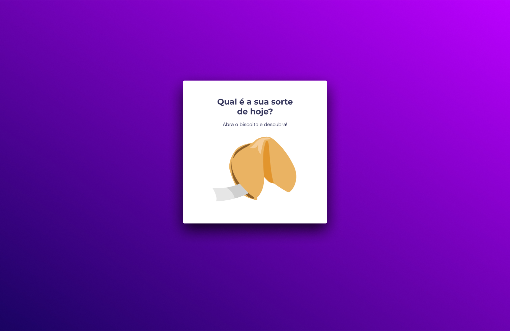

<h1 align="center"> Fortune cookie </h1>

Repositório do desafio extra do stage 05 da turma 09 do explorer, o objetivo era criar uma página que com um biscoito da sorte interativo.  

  <a href="#technologies">Technologies</a>&nbsp;&nbsp;&nbsp;|&nbsp;&nbsp;&nbsp;
  <a href="#project">Project</a>&nbsp;&nbsp;&nbsp;|&nbsp;&nbsp;&nbsp;
  <a href="#layout">Layout</a>

 

  

## 🚀 Technologies

Esse projeto foi desenvolvido com as seguintes tecnologias:

- HTML e CSS
- JavaScript
- Git e Github
- Figma

## 💻 Project

O projeto consiste em uma página onde o usuário ao clicar sob o biscoito da sorte receberá uma mensagem previamente inserida escolhida randomicante.

- [Visite o projeto online](https://fortunecookie-raulrodmo.netlify.app/)

## 🔖 Layout

Você pode visualizar o layout do projeto através [DESSE LINK](https://www.figma.com/community/file/1182751789348533739). É necessário ter conta no [Figma](https://figma.com) para acessá-lo.

---

Made with 💜 by raulrodmo

